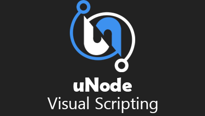

<p align="center">

</p>

uNode is a powerful visual scripting solution for Unity. It allows you to create complex game logic, AI behaviors, and interactions without writing a single line of code. Whether you're a beginner or an experienced developer, uNode empowers you to build interactive systems using a visual interface.

Download: [latest ](https://github.com/wahidrachmawan/uNode/releases)| [pro version](https://maxygames.com/download/)

<p align="center">
<a href="https://github.com/wahidrachmawan/uNode/blob/master/LICENSE"></a>
<a href="https://github.com/wahidrachmawan/uNode/releases/latest"></a>
<a href="https://discord.gg/8ufevvN"></a>

</p>

## **Why uNode**

1. **No Coding Required** : With uNode, you can express your ideas visually using nodes and connections. Say goodbye to syntax errors and debugging headaches!
2. **Flexibility** : uNode seamlessly integrates with Unity existing components. You can create custom nodes, extend functionality, and even integrate C# scripts when needed.
3. **Performance** : uNode generates optimized C# code behind the scenes, ensuring that your visual graphs run efficiently in your game.

## **FEATURES**

### **Graph Features**

| Feature                                                                                                  | Description                                                                                                                                                                                                                                                                        |
| -------------------------------------------------------------------------------------------------------- | ---------------------------------------------------------------------------------------------------------------------------------------------------------------------------------------------------------------------------------------------------------------------------------- |
| **Flow Graphs**                                                                                          | Powerful flow graphs for low-level logic and complex tasks.                                                                                                                                                                                                                        |
| **State Graphs**                                                                                         | Powerful state graphs which combine Flow, State Machine, and Behavior Tree into one graphs.                                                                                                                                                                                        |
| **Macros**                                                                                               | Create a graph once and reuse them in entire graphs with different parameters                                                                                                                                                                                                      |
| **[Runtime Graphs](https://docs.maxygames.com/unode3/manual/basic-concepts/graphs.html#runtime-graphs)** | Graph that can be run with Reflection or Native C#. It provide quick prototyping, live editing and fast compiling.<br />This has many graph types for different scenario, see more at: [here](https://docs.maxygames.com/unode3/manual/basic-concepts/graphs.html#types-of-graphs) |
| **[C# Graphs](https://docs.maxygames.com/unode3/manual/basic-concepts/graphs.html#c-graphs)**            | Graph that intended only for produce c# script for more advanced task.                                                                                                                                                                                                             |
| **[ECS Graph](https://github.com/wahidrachmawan/uNode3-DOTS)**                                           | (Experimental) DOTS support for uNode. You need to install it before it can be used.                                                                                                                                                                                               |

More graph info can be found on: [https://docs.maxygames.com/unode3/manual/basic-concepts/graphs.html](https://docs.maxygames.com/unode3/manual/basic-concepts/graphs.html)

### **Editor Features**

| Feature                    | Description                                                                                                                                                                                                                                                | Availability |
| -------------------------- | ---------------------------------------------------------------------------------------------------------------------------------------------------------------------------------------------------------------------------------------------------------- | :----------: |
| **C# Script Generation**   | Graphs will be automatically converted to C# scripts in order to maximize runtime performance.                                                                                                                                                             |      ✅      |
| **Fast Enter Play Mode**   | Support fast enter play mode, By fast enter/exit play mode you can quickly test and prototype ideas.                                                                                                                                                       |      ✅      |
| **Dynamic Nodes**          | Use automatically generated nodes for all and any Unity functionality, your code and 3rd party APIs.<br />Including Methods, Properties, Fields, Unity Events, C# Events, Generic Methods, Constructors and Operators.                                     |      ✅      |
| **Built-in Documentation** | Get instant access to Unity and custom documentation directly from the Editor.                                                                                                                                                                             |      ✅      |
| **Live Editing**           | Modify any part of your graphs while in playmode to quickly prototype and test ideas                                                                                                                                                                       |      ✅      |
| **Instant Node Search**    | Get instant node searching without the need to rebuild node library.<br />The node library is instantly refreshed based on using namespaces in each graph or can be customized in preference.                                                              |      ✅      |
| **Graph Organizing**       | Use namespace, variable & function grouping, region / node group, comment, and notes to fully organize your graphs.                                                                                                                                        |      ✅      |
| **Graph Inheritance**      | Enables you to create new graph that reuse, extend, and modify the behavior defined in other graph                                                                                                                                                         |      ✅      |
| **Graph Debugging**        | Insert breakpoints, watch connection, and watch variable changed in a graphs.<br />It can also debug connection and log to console with specific message when it reach the connection ( Pro Only )                                                         |      ✅      |
| **C# Parser**              | Quickly convert c# script into uNode graphs file, with support most of c# syntax.<br />You can find c# script in the internet or use ChatGPT to generate c# script and then use **C# Parser** to convert it to uNode graph.                                |   Pro Only   |
| **Realtime C# Preview**    | Preview generated c# script in realtime with syntax highlighting.<br />It will also highlight parts of the C# code that correspond to the selected graph elements in your graph.<br />There's **c# preview** for free version but the feature are limited. |   Pro Only   |
| **Find References**        | Quickly find all references/usages for variable, property, function, graph and nodes in project                                                                                                                                                      |   Pro Only   |
| **Graph Hierarchy**        | Easily navigate through your graph, find functions, macros, and see which nodes are currently active.                                                                                                                                                      |   Pro Only   |
| **Graph Search**           | Search all graph members ( graph, variable, property, etc ) in project easily.                                                                                                                                                                             |   Pro Only   |
| **Graph Trimming**         | Minimize build size by trimming graph at build time useful for targeting WebGL and mobile builds.                                                                                                                                                          |   Pro Only   |

**Supported Type:** All Type are supported ( Classes, Structs, Enums, Collections, Interfaces, etc ).

## **PERFORMANCE**

uNode has 2 options to run the graphs:

* **Native C#** (Auto in Build).
  The performance is same or near to handwritten c# script and it's by far the most faster visual scripting for Unity.
* **Optimized Reflection**
  Slow compared to native c# but its live editable.

## **COMPATIBILITY**

* **Development Platforms:** Support all platforms that Unity support.
* Works on Unity Pro and Free
* uNode 3 uses of Odin Serializer, therefore API compatibility level **.NET 4.x** is required.
* uNode 3 is not compatible with uNode 2.

## **Setup**

### Requirements

* Unity 2022.3 or later

### Installation

1. Open Package Manager from Window > Package Manager.
2. Click the "+" button > Add package from git URL.
3. Enter the following URL:

```
https://github.com/wahidrachmawan/uNode.git?path=Assets/uNode3
```

Or, open Packages/manifest.json and add the following to the dependencies block:

```json
{
    "dependencies": {
        "com.maxygames.unode": "https://github.com/wahidrachmawan/uNode.git?path=Assets/uNode3"
    }
}
```

Or through OpenUM openupm:  
[](https://openupm.com/packages/com.maxygames.unode/)

Or through a Unity Package:

[](http://package-installer.needle.tools/v1/installer/Openupm/com.maxygames.unode?registry=https://package.openupm.com)

## **Gallery**

[]()
[]()
[]()
[]()
[]()


## **Made with uNode**

### [Fine Volleyball](https://play.google.com/store/apps/details?id=com.FineGlassDigital.FineVolleyball)
[](https://play.google.com/store/apps/details?id=com.FineGlassDigital.FineVolleyball)

## **Sponsor**

If you enjoy or are finding uNode useful, consider supporting me by sponsoring this project or by buying pro version in asset store.
By sponsoring this project or buying pro version, you'll directly support its ongoing development. Your contributions will enable me to dedicate more time to enhancing uNode, adding new features, fixing bugs, and providing better documentation.

[](https://github.com/users/wahidrachmawan/sponsorship)

## **How You Can Help**

1. Spread the word in your developer communities
2. Contribute
   * Found a bug? Have an idea for improvement? Submit an issue or a pull request.
   * Help improve documentation, tutorials, and examples.
3. Community Engagement
   * Join the uNode Discord community to connect with other users and contributors.
   * Answer questions, share tips, and collaborate


## Links

### Community

- [Discord chat](https://discord.gg/8ufevvN).
- [uNode homepage](https://maxygames.com)
- [uNode documentation](https://docs.maxygames.com/unode3/index.html)

### Development Roadmap

- [uNode Roadmap](https://possible-ant-c4d.notion.site/uNode-v3-Roadmap-354b75489c5c48deacabb1597ba121a0), for a global view of the features that could be added.
- [GitHub issue page](https://github.com/wahidrachmawan/uNode/issues), for technical issues and bugs.

## License

**uNode 3 Free** is distributed under the Apache-2.0 License. Please see the About window for details, as well as third party notices for included open-source libraries.
